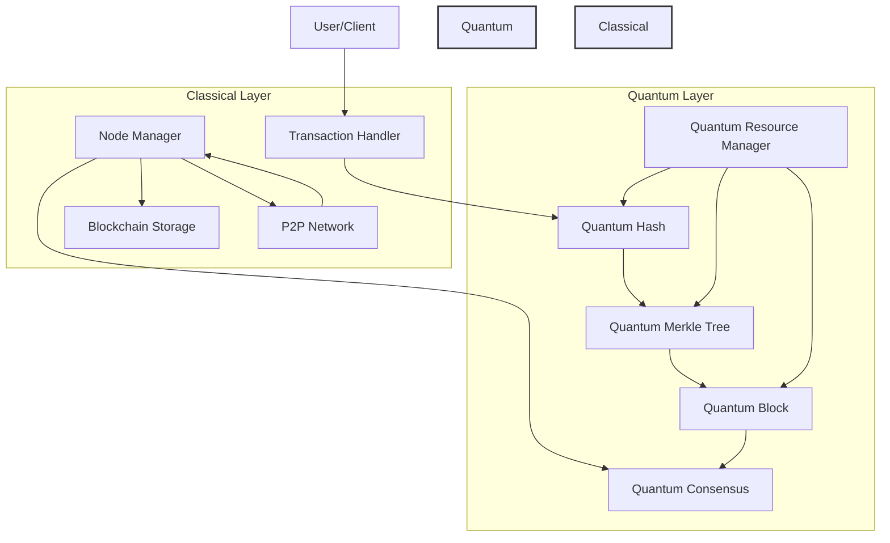

# Quantum Cryptocurrency

A next-generation cryptocurrency platform that leverages quantum computing capabilities to provide enhanced security and scalability. This project integrates Google's Willow quantum chip features with classical blockchain technology to create a hybrid quantum-classical cryptocurrency system.

```
🚀 Starting Quantum Cryptocurrency Node...
Node listening on 0.0.0.0:8333

📝 Creating sample transactions...
➕ Transaction added to pending pool. Total pending: 1
➕ Transaction added to pending pool. Total pending: 2

🔨 Creating new block...
📦 Creating new block with 2 transactions
⚙️ Generating quantum proof...
🔍 Validating block...
Block #40 added to chain

✅ New block created successfully!

📦 Block Details:
├── Height: #40
├── Timestamp: Tue Dec 10 16:05:55 2024
├── Previous Hash: QPROOF_7023475619602908150
├── Quantum Proof: QPROOF_9002009686329635771
└── Transactions: 2 total

💰 Transaction Details:
Transaction #1:
├── From: alice_pubkey
├── To: bob_pubkey
└── Amount: 10 QC
Transaction #2:
├── From: carol_pubkey
├── To: dave_pubkey
└── Amount: 20 QC

🔄 Node is running and ready for connections...

```

## 🌟 Key Features

### Quantum Security
- Quantum-resistant cryptographic keys using lattice-based cryptography
- Quantum-enhanced hashing algorithms for block validation
- Quantum Merkle tree implementation for secure transaction verification
- Advanced quantum state management for enhanced security

### Hybrid Architecture
- Seamless integration between quantum and classical nodes
- Scalable design supporting future quantum processor upgrades
- Compatible with existing blockchain infrastructure
- Distributed consensus mechanism combining classical and quantum approaches

### Technical Innovation
- Integration with Google's Willow quantum chip
- Custom quantum resource management
- Quantum-classical bridge for optimal performance
- Error correction and decoherence mitigation

## Benefits

- **Future-Proof Security**: Protected against both classical and quantum attacks
- **Scalability**: Designed to grow with advancing quantum technology
- **Compatibility**: Works with existing cryptocurrency infrastructure
- **Performance**: Optimized quantum circuits minimize coherence time overhead
- **Flexibility**: Supports both quantum and classical nodes in the network

## Practical Applications

- High-security financial transactions
- Quantum-safe digital asset management
- Enterprise-grade cryptocurrency solutions
- Research and development in quantum finance
- Cross-platform quantum-classical integration


### Architecture Overview



## System Requirements

### Local Installation
- Python 3.9+
- pip3
- Virtual environment support

### Docker Installation
- Docker Engine 20.10+
- Docker Compose 2.0+
- 4GB RAM minimum
- 10GB free disk space

## Installation Options

### Prerequisites
- Python 3.9+
- Docker and Docker Compose
- Node.js and npm (for frontend components)
- PostgreSQL

### Option 1: Local Installation
```bash
./install.sh
# Choose Local Installation
```

### Option 2: Docker Installation
```bash
./install.sh
# Choose Docker Installation
```

### Manual Setup
```bash
git clone https://github.com/yourusername/quantum_cryptocurrency.git
cd quantum_cryptocurrency
pip install -r quantum_crypto/requirements.txt
cp quantum_crypto/config/sample.env .env
# Edit .env as needed
docker-compose -f quantum_crypto/completion/deployment/docker/docker-compose.yml up
```

## Running the Node
```bash
./start.sh
# Choose:
# 1) Start Local Node
# 2) Start Docker Cluster
```

### Docker Cluster Management
When running in Docker mode (option 2), you'll have access to these management features:

1. Start Cluster - Launch all containers
2. Stop Cluster - Gracefully stop all services
3. View Logs - Monitor container logs in real-time
4. List Containers - See status of all running containers
5. Restart Cluster - Restart all services
6. Check Container Health - View detailed health status
7. Return to Main Menu - Exit cluster management

### Monitoring
```bash
# Docker logs
docker-compose logs -f

# Local logs
tail -f quantum_crypto/logs/node.log
```

## Testing
```bash
python -m pytest quantum_crypto/completion/testing/
```

- Unit, Integration, System tests
- Coverage reports and verbose options available

## Documentation
- [Technical Docs](quantum_crypto/completion/documentation/technical_docs.md)
- [User Guide](quantum_crypto/completion/documentation/user_guide.md)
- [Deployment Guide](quantum_crypto/completion/documentation/deployment_guide.md)

## Development Overview

### Tech Stack
- Backend: Python (Flask/FastAPI)
- Quantum: Qiskit
- Frontend: React.js + Redux
- Database: PostgreSQL
- DevOps: Docker, GitHub Actions


### Project Structure
```
quantum_crypto/
├── src/
│   ├── quantum_currency/           # Core quantum implementations
│   │   ├── __init__.py
│   │   ├── quantum_block.py       # Block creation and validation
│   │   ├── quantum_consensus.py   # Consensus mechanism
│   │   ├── quantum_hash.py        # Quantum hashing implementation
│   │   ├── quantum_keygen.py      # Key generation utilities
│   │   ├── quantum_merkle_tree.py # Quantum Merkle tree operations
│   │   └── quantum_resource_manager.py # Quantum resource handling
│   │
│   ├── classical_integration/     # Classical blockchain integration
│   │   ├── __init__.py
│   │   ├── network.py            # P2P networking
│   │   ├── node.py              # Node management
│   │   ├── storage.py           # Blockchain storage
│   │   └── transactions.py      # Transaction handling
│   │
│   └── main.py                  # Application entry point
│
├── config/                      # Configuration files
│   ├── config.py               # Core configuration
│   ├── logging.conf            # Logging configuration
│   └── sample.env              # Environment variables template
│
├── completion/                  # Project completion artifacts
│   ├── deployment/             # Deployment configurations
│   │   ├── docker/            # Docker setup files
│   │   ├── deploy_instructions.md
│   │   └── rollback_strategy.md
│   │
│   ├── documentation/          # Project documentation
│   │   ├── technical_docs.md
│   │   ├── user_guide.md
│   │   └── deployment_guide.md
│   │
│   └── testing/               # Test suites
│       ├── test_quantum_*.py  # Quantum component tests
│       ├── test_network.py    # Network tests
│       ├── system_tests.py    # End-to-end tests
│       └── integration_tests.py
│
├── specification/              # Project specifications
│   ├── objectives.md          # Project goals
│   ├── requirements.md        # System requirements
│   ├── user_scenarios.md      # Use cases
│   └── ui_ux.md              # Interface guidelines
│
├── refinement/                # Optimization and improvements
│   ├── performance_improvements.md
│   └── maintainability_refactors.md
│
├── README.md                  # Project overview
├── requirements.txt           # Python dependencies
├── package.json              # Node.js dependencies
├── install.sh                # Installation script
├── start.sh                  # Startup script
└── tests.sh                  # Test runner script
```

Key components:
- Quantum currency core logic
- Classical blockchain integration
- Modular design with specific modules for different functionalities


### Key Components
- Quantum Block
- Quantum Consensus
- Quantum Hash
- Classical Integration

### Advanced Usage (Example)
```python
from quantum_crypto.src.quantum_currency import QuantumBlock
from quantum_crypto.src.classical_integration import Node

node = Node.initialize_quantum()
block = QuantumBlock.create_new()
transaction = node.create_transaction(sender, receiver, amount)
quantum_proof = transaction.generate_quantum_proof()
node.validate_and_append(transaction, quantum_proof)
```

## Contributing
1. Fork the repo
2. Create a feature branch
3. Commit changes
4. Push and open a Pull Request

## User Guide

### Getting Started
1. **Installation**
   - Follow the deployment instructions to set up your node
   - Generate your quantum-resistant key pair
   - Configure your environment variables

2. **Creating Transactions**
   - Use the transaction interface to send quantum currency
   - Ensure sufficient balance before initiating transactions
   - Wait for quantum proof generation and confirmation

3. **Viewing Blockchain**
   - Access the block explorer to view recent blocks
   - Monitor transaction status and confirmations
   - Verify quantum proofs for enhanced security

### Features
- **Secure Transactions**: Leveraging quantum-resistant cryptography
- **Transparent Operations**: Quantum processes handled seamlessly
- **User-Friendly Interface**: Intuitive dashboard and forms


## 🧪 Testing

```bash
# Run all tests
python -m pytest quantum_crypto/completion/testing/

# Run specific test categories
python -m pytest quantum_crypto/completion/testing/unit_tests.py
python -m pytest quantum_crypto/completion/testing/integration_tests.py
python -m pytest quantum_crypto/completion/testing/system_tests.py
```

## License
MIT License - see [LICENSE](LICENSE)

## Acknowledgments
- Google's Willow quantum chip team
- The quantum computing research community
- Contributors and maintainers
