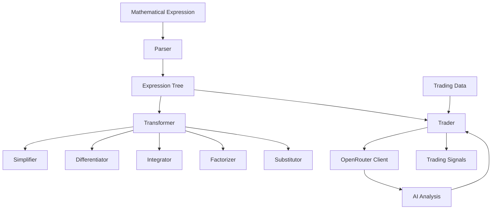

# Symbolic Math Trading Platform

## Introduction

The Symbolic Math Trading Platform is a component of the [Quantum Cryptocurrency](https://github.com/ruvnet/quantum_cryptocurrency) project. Built using the SPARC (Specification, Pseudocode, Architecture, Refinement, Completion) methodology, this system provides a robust foundation for both mathematical computations and algorithmic trading strategies.

The platform integrates traditional symbolic mathematics capabilities (differentiation, integration, etc.) with modern AI through OpenRouter API, enabling sophisticated analysis of mathematical patterns in trading data. This unique combination allows for both rigorous mathematical modeling and AI-enhanced decision making.

## Features

### Core Mathematical Operations
- Expression Parsing: Convert mathematical expressions to Abstract Syntax Trees (AST)
- Simplification: Reduce expressions to their simplest form
- Differentiation: Compute derivatives with support for:
  * Power rule
  * Product rule
  * Quotient rule
  * Chain rule
- Integration: Perform symbolic integration with support for:
  * Basic integrals
  * Power rule integration
  * Substitution method
- Factorization: Factor polynomial expressions
- Variable Substitution: Replace variables with values or expressions

### AI Integration
- OpenRouter API Integration for:
  * Expression analysis
  * Pattern recognition
  * Trading signal generation
  * Market sentiment analysis
- Multi-model support with fallback options
- Async processing for real-time analysis

### Trading Capabilities
- Multiple trading modes:
  * Simulation mode for testing
  * Live trading mode with safety checks
  * Backtesting mode for strategy validation
- Market analysis integration
- Risk management features
- Performance tracking

## Architecture



### Component Overview
1. **Parser Module**
   - Tokenization of mathematical expressions
   - Abstract Syntax Tree (AST) construction
   - Syntax validation and error handling

2. **Expression Tree**
   - Node types: Constants, Variables, Operators
   - Tree traversal and manipulation
   - Expression evaluation

3. **Transformer System**
   - Mathematical operations pipeline
   - Expression optimization
   - Result formatting

4. **Trading Integration**
   - Market data processing
   - Strategy implementation
   - Signal generation

5. **AI Analysis**
   - Pattern recognition
   - Trend analysis
   - Risk assessment

## Installation

1. Clone the repository:
```bash
git clone https://github.com/ruvnet/quantum_cryptocurrency.git
cd quantum_cryptocurrency/trading-platform/symbolic_trading
```

2. Create and activate virtual environment:
```bash
python -m venv venv
source venv/bin/activate  # Linux/Mac
# or
.\venv\Scripts\activate  # Windows
```

3. Install dependencies:
```bash
./scripts/install.sh
```

4. Configure environment:
```bash
cp config/sample.env .env
# Edit .env with your configurations, including OpenRouter API key
```

## Usage Guide

### Basic Mathematical Operations

```python
from src.transformers.transformer import Transformer
from src.parser.parser import Parser

# Initialize components
parser = Parser()
transformer = Transformer(parser)

# Simplify expression
result = transformer.simplify_expression("x^2 + 2*x + x^2")
print(result)  # Output: 2*x^2 + 2*x

# Compute derivative
derivative = transformer.differentiate_expression("x^3 + 2*x")
print(derivative)  # Output: 3*x^2 + 2

# Integrate expression
integral = transformer.integrate_expression("2*x")
print(integral)  # Output: x^2
```

### Trading Integration

```python
from src.trading.trader import Trader

# Initialize trader
trader = Trader()

# Analyze expression with AI
async def analyze_trading_pattern():
    analysis = await trader.analyze_expression("x^2 + 2*x + 1")
    print(analysis['trading_signals'])

# Execute in simulation mode
trade_result = await trader.execute_trade({
    'symbol': 'BTC-USD',
    'amount': 1.0,
    'type': 'market'
})
```

## Testing

The platform includes comprehensive test coverage:

```bash
# Run all tests
./scripts/test.sh

# Run specific test categories
./scripts/test.sh --unit
./scripts/test.sh --integration
./scripts/test.sh --performance
```

## Deployment

### Local Deployment
```bash
./scripts/start.sh
```

### Docker Deployment
```bash
docker-compose up --build
```

## Performance Considerations

- Expression parsing: O(n) time complexity
- Tree traversal: O(n) for most operations
- Memory usage: O(n) for expression trees
- API rate limiting: Configurable through .env
- Caching: Implemented for frequent operations

## Security

- Input validation for all expressions
- API key protection
- Rate limiting
- Error handling
- Trading safety checks

## Contributing

1. Fork the repository
2. Create your feature branch
3. Write tests for new features
4. Ensure all tests pass
5. Submit a pull request

## License

MIT License - see LICENSE file for details

## Acknowledgments

- SPARC Methodology
- OpenRouter API
- SymPy Library
- Trading Community

## Support

For support and questions:
- Create an issue on [GitHub](https://github.com/ruvnet/quantum_cryptocurrency/issues)
- View documentation in the `/docs` directory

## Roadmap

- [ ] Advanced integration techniques
- [ ] Neural network integration
- [ ] Real-time market data
- [ ] Web interface
- [ ] Mobile app

## Related Projects

This is part of the larger [Quantum Cryptocurrency](https://github.com/ruvnet/quantum_cryptocurrency) project, which includes:
- Quantum cryptography implementations
- Blockchain integration
- Advanced trading algorithms
